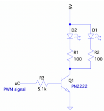

# Fa23 Embedded Systems Lab 3

### Mid-lab review (October 4):
Demonstrate that your program successfully utilizes the RPG as an input device to interactively update the two 7-segment displays.

### Deadline (October 11):
Upload source code and report to ICON (one source code file and report per group is sufficient). Sign up on the ICON calender is required if checking off on the day the lab is due.

---

### Lab Description
Construct a 60 second countdown timer that controls an LED-based light source using a rotary pulse generator (RPG), two 8-bit shift registers, a push-button switch, two 7-segment LED displays, and all components required to control the LEDs (Fig. 1).

Figure 1. Circuit for operating the 2 LEDs with the microcontroller. Resistors R1 and R2 limit the current through each LED to about 19 mA, resulting in a Q1 collector current of 38 mA.

---

### Operation:
| **Condition** | **Function** |
|:--- |:--- |
| Startup | Display “--“ |
| CW RPG operation | Increment displayed value (“--“ -> “01” -> “02” -> ... -> “60”) |
| CCW RPG operation | Decrement displayed value (“60” -> “59” -> ... -> “00” -> “--“) |
| Displaying “60” & CW RPG operation | No change to display |
| Displaying “--” & CCW RPG operation | No change to display |
| <1s pushbutton press | LEDs turn on; Begin decrement once per second from displayed value |
| Decrement reaches “00" | LEDs turn off; Wait 1 second; Display “--“; Allow new value selection |
| Count-down active & RPG operated | No change, ignore input |
| \>1s pushbutton press | Display "--"; Turn off LEDs |

### Notes:
* All pushbutton actions must be applied on release.
* Must use a suitable debounce approach for RPG and push button (as discussed in lecture).
* Must use a lookup table in program memory to store 7-segment patterns.
* Current driving each segment in the 7-segment display must be <= 6 mA.
* Must utilize 8-bit Timer/Counter0 hardware (without interrupts) for generating all required time sequences.
